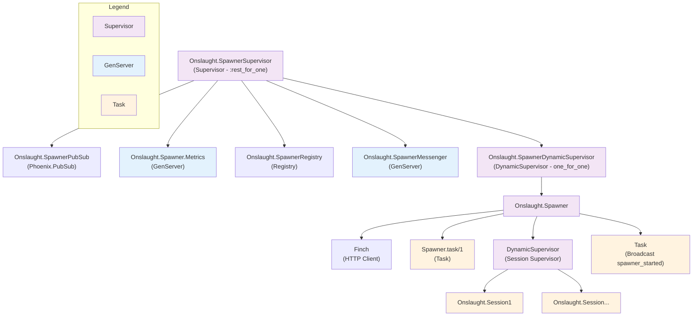

# Onslaught

## Quick Start with Docker

This application is packaged as a Docker image for easy deployment and usage.

### Build and Run

`!!!TODO!!!`

Add instructions for local development!

3. **Access the application**: Open your browser and visit [http://localhost:4000](http://localhost:4000)

### Environment Variables

The application supports the following optional environment variables:

- `PHX_HOST` (optional): The hostname for the application (default: localhost)
- `PORT` (optional): The port to run on (default: 4000)

Note: `SECRET_KEY_BASE` is automatically generated during the Docker build process, so you don't need to provide it.

### Production Deployment

For production deployment, you can use any container orchestration platform:

```bash
docker run -d -p 4001:4000 \
  --network=onslaught.internal \
  --network-alias=onslaught.internal \
  -e COOKIE=brian1234 \
  -e DNS_CLUSTER_QUERY=onslaught.internal \
  onslaught
```

## Development Setup (for Elixir developers)

To start your Phoenix server:

- Run `mix setup` to install and setup dependencies
- Start Phoenix endpoint with `mix phx.server` or inside IEx with `iex -S mix phx.server`

Now you can visit [`localhost:4000`](http://localhost:4000) from your browser.

Ready to run in production? Please [check our deployment guides](https://hexdocs.pm/phoenix/deployment.html).

## Learn more

- Official website: <https://www.phoenixframework.org/>
- Guides: <https://hexdocs.pm/phoenix/overview.html>
- Docs: <https://hexdocs.pm/phoenix>
- Forum: <https://elixirforum.com/c/phoenix-forum>
- Source: <https://github.com/phoenixframework/phoenix>

## Architecture

### SpawnerSupervisor Architecture

For those interested in the internals, the following diagram shows the supervision hierarchy.

One key aspect is that **for each spawn** the `SpawnerMessenger` receives messages from user LiveView sessions (using Phoenix PubSub broadcast to reach all nodes) and it will then startup a `Spawner` with the supervison tree below it to support the spawning and sessions activity.


